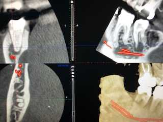

A 69 y.o female patient has a fractured non-restorable tooth #31. CBCT was taken and periapical lesion was noted close to IA canal. My plan is to leave the periapical pathosis and let the body take care of the healing. What if there is minimal bleeding or no bleeding at the extraction site? Would you induce bleeding and curette out as much of the cyst and leave the apical portion? Would you place a collagen membrane or bone graft? How can I prevent fibrous encapsulation of this site? I appreciate any advice on this case.  
Thank you

